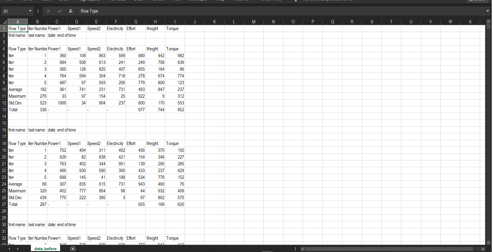
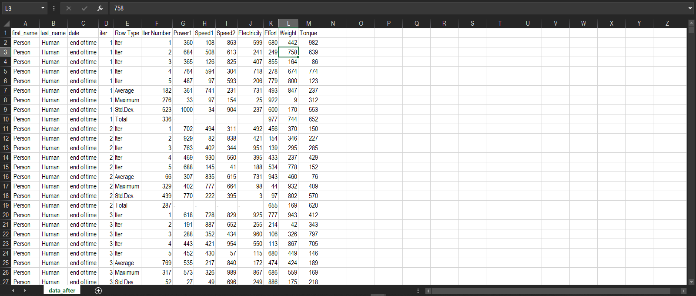

## Wrangling messy data set using Python:

I came across a chanllenge introduced by Shashank Kalanithi. it's a data set in form of an CSV file with unorganized columns and diffecult for a computer to process, as follows:

The chanllenge was to transform this data in the regular form of long thin tables, and it went to be like this:

